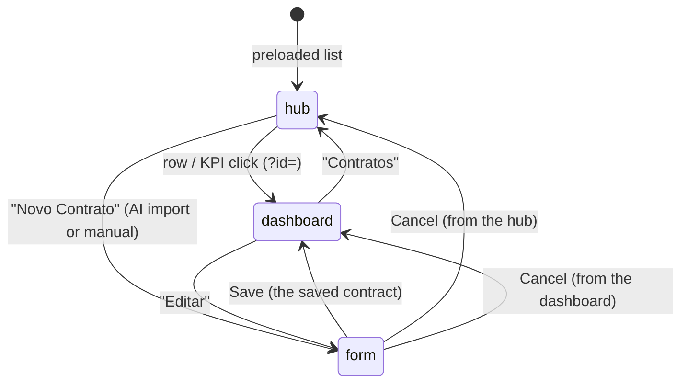

# Contratos (Leases / Rental Contracts) Module

**Version:** 1.1  
**Last updated:** 2026-09-25  
**Author:** Kitnets Engineering  

---

## Table of Contents

1. [Overview](#1-overview)
2. [Architecture & File Structure](#2-architecture--file-structure)
3. [Data Model](#3-data-model)
   - 3.1 [Core Interfaces (`Lease`, `LeaseWithDetails`)](#31-core-interfaces-lease-leasewithdetails)
   - 3.2 [Related Entities (`LeaseTenant`, `LeaseCharge`, `LeaseDocument`)](#32-related-entities-leasetenant-leasecharge-leasedocument)
   - 3.3 [Form Data Interfaces (`LeaseFormData`, `ChargeFormItem`, `AdditionalTenantFormItem`)](#33-form-data-interfaces-leaseformdata-chargeformitem-additionaltenantformitem)
   - 3.4 [Enumerations (`LeaseStatus`, `LeaseManagementType`, `AdjustmentIndex`, `ChargeType`, `ChargeResponsibility`, `DocumentType`, `LeaseTenantRole`)](#34-enumerations)
   - 3.5 [Dropdown Types (`LeasePropertyOption`, `LeaseTenantOption`, `LeaseAgencyOption`, `LeaseAgentOption`)](#35-dropdown-types)
4. [Database Schema & Storage](#4-database-schema--storage)
   - 4.1 [Table: `public.leases`](#41-table-publicleases)
   - 4.2 [Table: `public.lease_tenants`](#42-table-publicleasetenants)
   - 4.3 [Table: `public.lease_charges`](#43-table-publicleasecharges)
   - 4.4 [Table: `public.lease_documents`](#44-table-publicleasedocuments)
   - 4.5 [Indexes & Constraints](#45-indexes--constraints)
   - 4.6 [Triggers (`trg_leases_updated_at`)](#46-triggers)
   - 4.7 [Row Level Security (RLS)](#47-row-level-security-rls)
   - 4.8 [Supabase Storage Bucket (`lease-documents`)](#48-supabase-storage-bucket-lease-documents)
5. [Management Models](#5-management-models)
   - 5.1 [Self-Managed (`SELF_MANAGED`)](#51-self-managed-selfmanaged)
   - 5.2 [Agency-Managed (`AGENCY`) & Membership Architecture](#52-agency-managed-agency--membership-architecture)
   - 5.3 [Autonomous Agent (`AGENT`)](#53-autonomous-agent-agent)
6. [API Routes](#6-api-routes)
   - 6.1 [GET /api/leases](#61-get-apileases)
   - 6.2 [POST /api/leases](#62-post-apileases)
   - 6.3 [GET /api/leases/[id]](#63-get-apileasesid)
   - 6.4 [PUT /api/leases/[id]](#64-put-apileasesid)
   - 6.5 [DELETE /api/leases/[id]](#65-delete-apileasesid)
   - 6.6 [POST /api/leases/[id]/terminate](#66-post-apileasesidterminate)
   - 6.7 [POST /api/leases/[id]/documents](#67-post-apileasesiddocuments)
   - 6.8 [DELETE /api/leases/[id]/documents](#68-delete-apileasesiddocuments)
   - 6.9 [GET /api/leases/dropdowns](#69-get-apileasesdropdowns)
7. [Components](#7-components)
   - 7.1 [Page Wrapper (`page.tsx`)](#71-page-wrapper-pagetsx)
   - 7.2 [ContratosContent (Page Orchestrator)](#72-contratoscontent-page-orchestrator)
   - 7.3 [LeaseProfileCard (Detail Profile Card)](#73-leaseprofilecard-detail-profile-card)
8. [UI Flow, States & Modals](#8-ui-flow-states--modals)
   - 8.1 [State Machine](#81-state-machine)
   - 8.2 [Contract Listing & Dynamic Status Badges](#82-contract-listing--dynamic-status-badges)
   - 8.3 [Contract Form Sections](#83-contract-form-sections)
   - 8.4 [Termination Modal Workflow](#84-termination-modal-workflow)
   - 8.5 [Document Upload & Management Modal](#85-document-upload--management-modal)
   - 8.6 [Soft Delete Modal](#86-soft-delete-modal)
9. [Calculations, Validations & Formats](#9-calculations-validations--formats)
   - 9.1 [Automatic Next Adjustment Date Calculation](#91-automatic-next-adjustment-date-calculation)
   - 9.2 [Dynamic Status Resolution (Expiring Soon & Expired)](#92-dynamic-status-resolution-expiring-soon--expired)
   - 9.3 [Brazilian Currency Formatting (BRL)](#93-brazilian-currency-formatting-brl)
   - 9.4 [Date Masking & ISO Conversions (DD/MM/YYYY)](#94-date-masking--iso-conversions-ddmmyyyy)
   - 9.5 [Active Lease Warning Check](#95-active-lease-warning-check)
10. [Cross-Module Dependencies](#10-cross-module-dependencies)
11. [Design Decisions](#11-design-decisions)
12. [Changelog](#12-changelog)

---

## 1. Overview

The **Contratos (Leases) Module** (`/[lang]/contratos`) is the central operational hub of Kitnets.com. It formalizes and manages the contractual relationship between:

1. **A Property (`public.properties`)**: The physical unit or kitnet being leased.
2. **A Primary Tenant (`public.tenants`)**: The legal lessee responsible for rent payments, with optional co-tenants or occupants (`public.lease_tenants`).
3. **Management Structure**: Either self-managed by the landlord or outsourced to a real estate agency (`public.agencies`) and/or a real estate agent (`public.agents`).
4. **Financial Terms**: Base rent, due day, security deposit, and recurring charges (Condominium, IPTU, utilities) with designated responsibility.
5. **Readjustment Framework**: Official economic indexing (IPCA, IGP-M, INPC, IVAR, Custom), frequency, and anniversary dates.
6. **Digital Document Vault**: Storage for signed PDFs, addenda, inspection reports (*laudos de vistoria*), deposit receipts, and identity documents in Supabase Storage.

---

## 2. Architecture & File Structure

```
apps/web/src/
├── app/
│   ├── [lang]/contratos/
│   │   ├── page.tsx                     # Server component: preloads the list (and the dashboard of ?id=) before the first paint
│   │   └── ContratosContent.tsx        # Client orchestrator: hub ↔ contract dashboard (?id=) ↔ form; owns the shared modals
│   └── api/leases/
│       ├── route.ts                     # GET (list, via lib/lease-views-server) + POST (create lease + charges + co-tenants)
│       ├── dropdowns/
│       │   └── route.ts                 # GET properties (with units), tenants, agencies, agents
│       ├── extract/route.ts             # POST: AI reading of a lease agreement (lib/lease-extract.ts)
│       ├── upload-url/route.ts          # POST: signed URL for a direct-to-storage upload (past Vercel's 4.5 MB body limit)
│       └── [id]/
│           ├── route.ts                 # GET (details), PUT (update), DELETE (soft delete)
│           ├── dashboard/route.ts       # GET: the contract's dashboard bundle (lease, tenant contact, ledger months, index series)
│           ├── terminate/route.ts       # POST (terminate lease with date & reason)
│           └── documents/route.ts       # POST (multipart ≤ 5 MB, or adopt a staged upload) + DELETE
├── components/contratos/
│   ├── ContratosHub.tsx                 # The hub: KPI strip, "Atenção" list, view pills, filters, table or timeline
│   ├── LeaseTable.tsx                   # Sortable table of contracts (row → dashboard; edit / terminate / delete)
│   ├── LeaseTimeline.tsx                # Gantt-style calendar of the contracts (bars by status, today, adjustments)
│   ├── LeaseDashboard.tsx               # One contract: KPI tiles, rent chart, ficha, milestones, files
│   ├── LeaseRentChart.tsx               # recharts: received per month (bars) vs gross rent (line), from the income ledger
│   ├── LeaseDocuments.tsx               # Files of a contract: typed uploads (drag & drop, 10 MB), viewer, delete
│   ├── LeaseForm.tsx                    # Create / edit form (collapsible sections; files live on the dashboard)
│   ├── LeaseImportModal.tsx             # AI import of one agreement: reading + party matching + what to create
│   └── LeaseBatchImportModal.tsx        # "Importar contratos antigos": several PDFs in a row, each settled and created
├── lib/
│   ├── lease-dashboard.ts (+ test)      # Pure maths: display status, views, hub totals, attention list, timeline, income of a lease, unit guess
│   ├── lease-views.ts                   # The list / dashboard view types (client-safe)
│   ├── lease-views-server.ts            # Builds those views for the page preload and the API routes
│   ├── lease-summary.ts (+ test)        # Term, due dates, adjustment cycle and index accumulation (shared with the property page)
│   ├── lease-import-client.ts (+ test)  # Turns a reviewed import into a lease (unit cards, batch import)
│   └── lease-upload-client.ts           # Direct-to-storage staging and `attachLeaseDocument`
└── types/
    └── lease.ts                         # Complete TypeScript type definitions

supabase/legacy/core/
└── lease_setup.sql                      # DDL for leases, child tables, RLS, & storage bucket
```

---

## 3. Data Model

### 3.1 Core Interfaces (`Lease`, `LeaseWithDetails`)

Defined in [lease.ts](file:///c:/Users/Administrator/Documents/Kitnets/apps/web/src/types/lease.ts):

```typescript
export interface Lease {
    id: string;
    user_id: string;
    reference_name: string | null;

    // Property & tenant
    property_id: string;
    primary_tenant_id: string;

    // Management
    management_type: LeaseManagementType;
    agency_id: string | null;
    agent_id: string | null;

    // Lease terms
    start_date: string;                   // ISO string: "YYYY-MM-DD"
    end_date: string | null;              // ISO string or null (open-ended contract)
    monthly_rent: number;                 // BRL float (e.g. 1500.00)
    rent_due_day: number;                 // Day of month: 1 - 31
    security_deposit: number | null;      // Caução / Depósito
    deposit_months: number | null;

    // Rent adjustment
    adjustment_index: AdjustmentIndex | null;
    adjustment_frequency: number | null;  // Months (e.g., 12)
    next_adjustment_date: string | null;  // ISO string

    // Status
    status: LeaseStatus;

    // Termination
    termination_date: string | null;
    termination_reason: string | null;

    // Notes & audit
    notes: string | null;
    created_at: string;
    updated_at: string;
    deleted_at: string | null;
}

export interface LeaseWithDetails extends Lease {
    property_name: string | null;
    primary_tenant_name: string | null;
    agency_name: string | null;
    agent_name: string | null;
    additional_tenants: LeaseTenantWithName[];
    charges: LeaseCharge[];
    documents: LeaseDocument[];
}
```

### 3.2 Related Entities (`LeaseTenant`, `LeaseCharge`, `LeaseDocument`)

```typescript
export interface LeaseTenant {
    id: string;
    lease_id: string;
    tenant_id: string;
    role: LeaseTenantRole; // 'CO_TENANT' | 'OCCUPANT'
}

export interface LeaseTenantWithName extends LeaseTenant {
    tenant_name: string | null;
}

export interface LeaseCharge {
    id: string;
    lease_id: string;
    charge_type: ChargeType;
    label: string | null;
    responsibility: ChargeResponsibility; // 'TENANT' | 'LANDLORD' | 'INCLUDED'
    amount: number | null;
}

export interface LeaseDocument {
    id: string;
    lease_id: string;
    document_type: DocumentType;
    file_url: string;
    file_name: string;
    file_size: number | null;
    mime_type: string | null;
    uploaded_at: string;
}
```

### 3.3 Form Data Interfaces (`LeaseFormData`, `ChargeFormItem`, `AdditionalTenantFormItem`)

```typescript
export interface LeaseFormData {
    reference_name: string;
    property_id: string;
    primary_tenant_id: string;
    management_type: LeaseManagementType;
    agency_id: string;
    agent_id: string;
    start_date: string;             // Displayed as DD/MM/YYYY
    end_date: string;               // Displayed as DD/MM/YYYY
    monthly_rent: string;           // Formatted BRL string "1.500,00"
    rent_due_day: string;           // "1" to "31"
    security_deposit: string;       // Formatted BRL string
    deposit_months: string;
    adjustment_index: string;
    adjustment_frequency: string;   // "12", "6", etc.
    next_adjustment_date: string;   // Displayed as DD/MM/YYYY
    status: LeaseStatus;
    notes: string;
}

export interface ChargeFormItem {
    charge_type: ChargeType;
    label: string;
    responsibility: ChargeResponsibility;
    amount: string;                 // Masked currency string
}

export interface AdditionalTenantFormItem {
    tenant_id: string;
    role: LeaseTenantRole;
}
```

### 3.4 Enumerations

| Enum | Allowed Values | Portuguese UI Label |
|---|---|---|
| `LeaseStatus` | `DRAFT`, `ACTIVE`, `EXPIRING_SOON`, `EXPIRED`, `TERMINATED`, `CANCELLED` | Rascunho, Ativo, Vencendo, Expirado, Rescindido, Cancelado |
| `LeaseManagementType` | `SELF_MANAGED`, `AGENCY`, `AGENT` | Gestão própria, Imobiliária, Corretor |
| `AdjustmentIndex` | `IPCA`, `IGP_M`, `INPC`, `IVAR`, `CUSTOM`, `NONE` | IPCA (IBGE), IGP-M (FGV), INPC (IBGE), IVAR (FGV), Personalizado, Nenhum |
| `ChargeType` | `CONDOMINIUM`, `IPTU`, `WATER`, `ELECTRICITY`, `GAS`, `INTERNET`, `OTHER` | Condomínio, IPTU, Água, Energia Elétrica, Gás, Internet, Outro |
| `ChargeResponsibility` | `TENANT`, `LANDLORD`, `INCLUDED` | Inquilino, Proprietário, Incluso no aluguel |
| `DocumentType` | `CONTRACT`, `ADDENDUM`, `INSPECTION`, `TENANT_DOC`, `DEPOSIT_RECEIPT`, `OTHER` | Contrato, Aditivo, Laudo de Vistoria, Documento do Inquilino, Recibo de Caução, Outro |
| `LeaseTenantRole` | `CO_TENANT`, `OCCUPANT` | Co-locatário, Ocupante |

### 3.5 Dropdown Types

```typescript
export interface LeasePropertyOption { id: string; name: string; }
export interface LeaseTenantOption { id: string; full_name: string; }
export interface LeaseAgencyOption { id: string; name: string; }
export interface LeaseAgentOption { id: string; full_name: string; agency_id: string | null; }
```

---

## 4. Database Schema & Storage

Created via `supabase/legacy/core/lease_setup.sql`.

### 4.1 Table: `public.leases`

```sql
CREATE TABLE IF NOT EXISTS public.leases (
    id UUID PRIMARY KEY DEFAULT uuid_generate_v4(),
    user_id UUID NOT NULL REFERENCES public.profiles(id) ON DELETE CASCADE,
    reference_name TEXT,
    property_id UUID NOT NULL REFERENCES public.properties(id) ON DELETE RESTRICT,
    primary_tenant_id UUID NOT NULL REFERENCES public.tenants(id) ON DELETE RESTRICT,
    management_type TEXT NOT NULL CHECK (management_type IN ('SELF_MANAGED', 'AGENCY', 'AGENT')),
    agency_id UUID REFERENCES public.agencies(id) ON DELETE SET NULL,
    agent_id UUID REFERENCES public.agents(id) ON DELETE SET NULL,
    start_date DATE NOT NULL,
    end_date DATE,
    monthly_rent NUMERIC(12, 2) NOT NULL CHECK (monthly_rent > 0),
    rent_due_day INT NOT NULL CHECK (rent_due_day >= 1 AND rent_due_day <= 31),
    security_deposit NUMERIC(12, 2),
    deposit_months INT,
    adjustment_index TEXT CHECK (adjustment_index IS NULL OR adjustment_index IN ('IPCA', 'IGP_M', 'INPC', 'IVAR', 'CUSTOM', 'NONE')),
    adjustment_frequency INT DEFAULT 12,
    next_adjustment_date DATE,
    status TEXT NOT NULL DEFAULT 'ACTIVE' CHECK (status IN ('DRAFT', 'ACTIVE', 'EXPIRING_SOON', 'EXPIRED', 'TERMINATED', 'CANCELLED')),
    termination_date DATE,
    termination_reason TEXT,
    notes TEXT,
    created_at TIMESTAMPTZ DEFAULT NOW() NOT NULL,
    updated_at TIMESTAMPTZ DEFAULT NOW() NOT NULL,
    deleted_at TIMESTAMPTZ,
    deleted_by UUID REFERENCES public.profiles(id),
    CONSTRAINT chk_lease_dates CHECK (end_date IS NULL OR end_date > start_date)
);
```

### 4.2 Table: `public.lease_tenants`

Associates secondary tenants or occupants to a lease:

```sql
CREATE TABLE IF NOT EXISTS public.lease_tenants (
    id UUID PRIMARY KEY DEFAULT uuid_generate_v4(),
    lease_id UUID NOT NULL REFERENCES public.leases(id) ON DELETE CASCADE,
    tenant_id UUID NOT NULL REFERENCES public.tenants(id) ON DELETE RESTRICT,
    role TEXT NOT NULL DEFAULT 'CO_TENANT' CHECK (role IN ('CO_TENANT', 'OCCUPANT')),
    UNIQUE(lease_id, tenant_id)
);
```

### 4.3 Table: `public.lease_charges`

```sql
CREATE TABLE IF NOT EXISTS public.lease_charges (
    id UUID PRIMARY KEY DEFAULT uuid_generate_v4(),
    lease_id UUID NOT NULL REFERENCES public.leases(id) ON DELETE CASCADE,
    charge_type TEXT NOT NULL CHECK (charge_type IN ('CONDOMINIUM', 'IPTU', 'WATER', 'ELECTRICITY', 'GAS', 'INTERNET', 'OTHER')),
    label TEXT,
    responsibility TEXT NOT NULL DEFAULT 'TENANT' CHECK (responsibility IN ('TENANT', 'LANDLORD', 'INCLUDED')),
    amount NUMERIC(12, 2)
);
```

### 4.4 Table: `public.lease_documents`

```sql
CREATE TABLE IF NOT EXISTS public.lease_documents (
    id UUID PRIMARY KEY DEFAULT uuid_generate_v4(),
    lease_id UUID NOT NULL REFERENCES public.leases(id) ON DELETE CASCADE,
    document_type TEXT NOT NULL DEFAULT 'OTHER' CHECK (document_type IN ('CONTRACT', 'ADDENDUM', 'INSPECTION', 'TENANT_DOC', 'DEPOSIT_RECEIPT', 'OTHER')),
    file_url TEXT NOT NULL,
    file_name TEXT NOT NULL,
    file_size INT,
    mime_type TEXT,
    uploaded_at TIMESTAMPTZ DEFAULT NOW() NOT NULL
);
```

### 4.5 Indexes & Constraints

- `idx_leases_user_id`: Fast retrieval of leases by owner.
- `idx_leases_property_id`: Quick lookup of all leases assigned to a specific property.
- `idx_leases_primary_tenant_id`: Indexing for tenant lease history.
- `idx_leases_status` (`WHERE deleted_at IS NULL`): Filter active leases.
- `idx_leases_property_active` (`WHERE status = 'ACTIVE' AND deleted_at IS NULL`): Immediate check for concurrent active leases on a single unit.
- `chk_lease_dates`: Enforces that `end_date > start_date` if `end_date` is provided.

### 4.6 Triggers

A PostgreSQL trigger automatically updates `updated_at`:
```sql
CREATE TRIGGER trg_leases_updated_at
    BEFORE UPDATE ON public.leases
    FOR EACH ROW
    EXECUTE FUNCTION public.update_leases_updated_at();
```

### 4.7 Row Level Security (RLS)

All 4 tables have Row Level Security enabled:
```sql
ALTER TABLE public.leases ENABLE ROW LEVEL SECURITY;
ALTER TABLE public.lease_tenants ENABLE ROW LEVEL SECURITY;
ALTER TABLE public.lease_charges ENABLE ROW LEVEL SECURITY;
ALTER TABLE public.lease_documents ENABLE ROW LEVEL SECURITY;
```
Direct client SELECT is constrained to `user_id = auth.uid()`. All backend API mutations run through the Supabase service role key after verifying Clerk session context.

### 4.8 Supabase Storage Bucket (`lease-documents`)

A public Supabase storage bucket `lease-documents` holds binary files.
- **Allowed MIME types:** `application/pdf`, `image/jpeg`, `image/jpg`, `image/png`.
- **Max file size:** 5 MB.
- **Storage path schema:** `leases/{lease_id}/{uuid}_{sanitized_filename}`.

---

## 5. Management Models

The module supports three operational models for lease administration:

### 5.1 Self-Managed (`SELF_MANAGED`)
- The property owner manages the tenancy directly.
- `agency_id` and `agent_id` are set to `NULL`.

### 5.2 Agency-Managed (`AGENCY`) & Membership Architecture
- In Kitnets.com, real estate agencies follow an **organization membership model** via `agency_members`, rather than a direct `agencies.user_id` foreign key.
- When an agency is selected:
  1. The API verifies whether the user is a member of that agency via `agency_members` (`WHERE agency_id = ? AND user_id = profile.id`).
  2. Fallback check confirms that the agency exists in `public.agencies` and has not been deleted.
- Optionally, the user may assign a specific broker belonging to that agency (`form.agent_id`), which filters agents where `agent.agency_id === form.agency_id`.

### 5.3 Autonomous Agent (`AGENT`)
- An independent, autonomous broker manages the contract on behalf of the owner.
- `agency_id` is set to `NULL` while `agent_id` is required.

---

## 6. API Routes

All endpoints verify Clerk authentication via `currentUser()` and resolve `profile.id` from `public.profiles`.

### 6.1 `GET /api/leases`
Returns all non-deleted leases for the current user, joining property, primary tenant, agency, and agent names.

### 6.2 `POST /api/leases`
Creates a new lease contract with optional child entries for `lease_tenants` and `lease_charges`.
- **Validates**: `property_id`, `primary_tenant_id`, `start_date`, `monthly_rent > 0`, `rent_due_day (1-31)`, and `agency_id` / `agent_id`.
- **Active Lease Warning**: Checks whether the unit already has an active lease. If so, saves the contract but returns a non-blocking `warning` string to alert the user.

### 6.3 `GET /api/leases/[id]`
Returns the full contract details including:
- Joined property, tenant, agency, and agent names
- List of co-tenants/occupants (`lease_tenants` joined with `tenants.full_name`)
- List of additional charges (`lease_charges`)
- List of uploaded documents (`lease_documents`)

### 6.4 `PUT /api/leases/[id]`
Updates an existing lease contract:
- Replaces child records for `lease_tenants` and `lease_charges` within the transaction.
- Verifies property ownership, tenant validity, and agency/agent affiliations.

### 6.5 `DELETE /api/leases/[id]`
Executes a soft delete by setting `deleted_at = NOW()` and `deleted_by = profile.id`.

### 6.6 `POST /api/leases/[id]/terminate`
Formalizes early contract rescission or standard termination without deleting history:
- **Body**: `{ termination_date: "YYYY-MM-DD", termination_reason?: string, notes?: string }`
- **Mutations**: Sets `status = 'TERMINATED'`, records date & reason, preserves existing notes.

### 6.7 `POST /api/leases/[id]/documents`
Uploads a document via `multipart/form-data`:
- **Payload**: `file` (File), `document_type` (Enum)
- **Validation**: Enforces 5 MB limit and permitted MIME types (`pdf`, `jpg`, `png`).
- **Destination**: Uploads to Supabase Storage bucket `lease-documents` and inserts a record into `public.lease_documents`.

### 6.8 `DELETE /api/leases/[id]/documents?doc_id=xxx`
Deletes the file from Supabase Storage and deletes the row from `public.lease_documents`.

### 6.10 `GET /api/leases/[id]/dashboard`
Everything one contract's dashboard shows, in one request: the lease with names, additional tenants, charges and documents (signed URLs), the primary tenant's contact (phone, e-mail), the property's income ledger rows over the lease's months (every unit — `lib/lease-dashboard.ts` cuts them to the lease's unit) and the lease's index series. The page preloads the same bundle on the server (`loadLeaseDashboard` in `lib/lease-views-server.ts`); the client calls this route to refresh after an edit.

### 6.9 `GET /api/leases/dropdowns`
Fetches all necessary dropdown options in a single parallel request:
- Properties owned by user (`public.properties`)
- Tenants registered by user (`public.tenants`)
- Agencies where user has membership (`agency_members` -> `agencies`)
- Agents registered by user (`public.agents`)

---

## 7. Components

### 7.1 Page Wrapper (`page.tsx`)
Server component setting dynamic rendering (`force-dynamic`, `revalidate = 0`) and page metadata before rendering `ContratosContent`.

### 7.2 ContratosContent (Page Orchestrator)
Located in `apps/web/src/app/[lang]/contratos/ContratosContent.tsx`:
- Three screens: the **hub** (`/contratos`), one contract's **dashboard** (`?id=<lease>`; the old `?lease=` deep link from the property card still works) and the **form** (create / edit, component state).
- Seeds the list and the dashboard from what `page.tsx` preloaded on the server (no first fetch); refreshes go through `GET /api/leases` and `GET /api/leases/[id]/dashboard`. The index series of the leases' indexes come with the preload, else from `/api/indices/{code}/calculator-data`.
- Keeps the view (`?view=vigentes|vencendo|encerrados|rascunhos|todos`) in the URL, like Projetos.
- Owns the shared modals: terminate, delete, the AI import of a new contract (`LeaseImportModal`), the batch import of old contracts (`LeaseBatchImportModal`) and the PDF viewer.

### 7.3 ContratosHub (the dashboard on the hub)
`components/contratos/ContratosHub.tsx` — what the portfolio of leases looks like at a glance:
- **KPI strip** (`hubTotals` in `lib/lease-dashboard.ts`): contracts in force (with how many end within 90 days or have the term over), contracted rent per month (Σ of the contracts in force, gross), next term end, next rent adjustment (with the index accumulated so far), deposits held, contracts with their PDF attached.
- **Atenção** (`attentionItems`): terms already over (the lease keeps running month to month — renew, extend or terminate), terms ending within 90 days, adjustments within 30 days, unfinished drafts, contracts without their file. Most pressing first.
- **View pills** with counts, search, property and management filters, and a **Lista / Linha do tempo** toggle.
- **LeaseTable**: sortable columns (contract, rent, start, end, adjustment), the term's progress, the next adjustment with the accumulated index, who manages it, the file. A row opens the dashboard; the icons edit, terminate or delete.
- **LeaseTimeline**: one bar per contract on a calendar (colour by status, a hatched tail for a term over while still in force, diamonds for past adjustments, a filled one for the next, today as a line). Pure CSS percentages, so it needs no measuring.

### 7.4 LeaseDashboard (one contract)
`components/contratos/LeaseDashboard.tsx` — opened from any row or KPI:
- Header: reference, status pill, place · tenant · management; actions Ver PDF, Editar, Rescindir (in force only), Excluir. A term already over shows the "prazo indeterminado" notice (Lei 8.245/91, art. 46 §1º).
- **Six tiles** (`components/properties/Tile` with the "?" explanation): rent (due day, next due date, tenant's charges), term (months, progress), next adjustment (index, frequency), the adjusted rent preview (`lib/lease-summary.ts`, the months of the cycle already published), received (Σ of the property's income ledger over the lease's months and unit — `leaseIncome`), deposit.
- **Aluguel mês a mês** (`LeaseRentChart`): received per month (bars; the months still "previsto" hollow) and the gross rent the ledger implies (line, one axis), with a link to the property's ledger.
- **Ficha do contrato**: property, tenant (WhatsApp link from the E.164 phone, e-mail), additional tenants, management, dates, due day, index, deposit, termination, charges table, notes.
- **Linha do tempo do contrato** (`milestones`): start, each adjustment, the next one, the end or the termination.
- **Arquivos do contrato** (`LeaseDocuments`): typed uploads (Contrato, Aditivo, Laudo de vistoria, Documento do inquilino, Recibo de caução, Outro) by button or drag & drop, several at once, up to 10 MB each through the staged direct upload (`attachLeaseDocument`); PDFs open in the app's viewer, pictures in the lightbox. The oldest CONTRACT file is flagged "Contrato assinado"; the previous contracts of the same tenant are filed here too.

### 7.5 LeaseBatchImportModal ("Importar contratos antigos")
Several PDFs of contracts that already ran, in one go. Each file goes through the same `LeaseImportModal` reading and party matching as a new contract (`initialFile` + `createsLease`), then a **settle** step: the unit of a multi-unit property (preselected by `guessUnit` from what the AI read — "Kitnet 35B", "35 D" —, confirmed by the user), the status (EXPIRED by default with "Registrar como encerrados"; ACTIVE when the contract is still running) and the reference name. `createLeaseFromImport` creates the lease (skipping one that already exists for the same unit, tenant and start) and attaches the PDF as its CONTRACT document. A file can be skipped; the closing summary links each created contract.

---

## 8. UI Flow, States & Modals

### 7.6 The corretor read from the contract
The extraction prompt asks for `agents`: the natural person who signs or answers for the agency (sócio, representante legal, corretor responsável — with their own CRECI-F, never the agency's CRECI-J) or the autonomous broker intermediating. `normalizeLeaseExtraction` keeps only the person's own CRECI, dedupes by CRECI, CPF and name, and — when nobody was listed but the agency names its representative — offers that person with the CRECI left to be typed. `matchAgent` (route `POST /api/leases/extract`, `matches.agents`) matches by CRECI (number + UF), then CPF, then an exact name. The review step of `LeaseImportModal` shows a **Corretor** section: matched → linked; not matched → "Cadastrar em Corretores" with name, CPF, CRECI + UF (required), phone and e-mail, created through `POST /api/agents` as IMOBILIARIA (linked to the contract's agency) or AUTONOMO. The lease gets `agent_id`; `management_type` is AGENCY when there is an agency, AGENT when only a corretor, SELF_MANAGED otherwise (`leasePayloadFromImport`, the form prefill). Tenants created in the same review carry the corretor too.

### 8.1 State Machine



### 8.2 Hub, Views & Dynamic Status
- **In force** = stored status ACTIVE / EXPIRING_SOON, whatever the calendar says: a Brazilian lease whose term ended keeps running month to month and the rent keeps coming, so it stays in "Vigentes" flagged **Prazo vencido** (rose) and in "Vencendo". Stored EXPIRED / TERMINATED / CANCELLED are "Encerrados" (a stored EXPIRED reads **Encerrado**, slate). Decision confirmed by the user on 2026-09-25: counting stays, only the label says it is the term, not the contract, that is over.
- **Display status** (`displayStatus`): ACTIVE within 30 days of the end → Vencendo; past the end → Prazo vencido (`statusMeta` picks the pill); DRAFT / TERMINATED / CANCELLED as stored.
- Views: Vigentes (default) · Vencendo · Encerrados · Rascunhos · Todos, kept in `?view=`; search and filters by property and management apply on top; Lista or Linha do tempo.

### 8.3 Contract Form Sections
The form is divided into clean collapsible cards:
1. **Identificação & Imóvel**: Reference name, property dropdown, primary tenant dropdown.
2. **Administração**: Self-managed, Agency (with agency selector and optional broker), or Broker.
3. **Prazos & Valores**: Start date, end date, monthly rent (auto-masked BRL), due day (1-31), security deposit value and months.
4. **Reajuste do Aluguel**: Index selector (IPCA, IGP-M, INPC, IVAR, Personalizado, Nenhum), frequency in months, and auto-computed next adjustment date.
5. **Taxas e Despesas Adicionais**: Dynamic repeater to add charges (Condomínio, IPTU, Água, etc.) with responsibility selector.
6. **Inquilinos Adicionais**: Dynamic repeater to attach other tenants as Co-locatário or Ocupante.
7. **Observações**: General notes textarea.

### 8.4 Termination Modal Workflow
Clicking "Rescindir" opens a confirmation dialog requiring:
- **Data de Rescisão** (DD/MM/YYYY)
- **Motivo da Rescisão** (e.g. "Acordo mútuo", "Inadimplência", "Solicitação do inquilino")
Upon submission, calls `POST /api/leases/[id]/terminate` and updates UI state immediately.

### 8.5 Files (on the contract's dashboard)
Files are no longer inside the form. `LeaseDocuments` on the dashboard takes PDF, JPG, PNG or WebP up to 10 MB (staged direct upload, then `POST /api/leases/[id]/documents { storage_path, file_name, document_type }`; a file that still fits a route body falls back to multipart), several at once, by button or drag & drop, under a chosen type (`Contrato`, `Aditivo`, `Laudo de Vistoria`, `Documento do Inquilino`, `Recibo de Caução`, `Outro`). PDFs open in the in-app viewer, pictures in the lightbox; deletion asks for confirmation.

### 8.6 Soft Delete Modal
Clicking "Excluir" prompts for confirmation before calling `DELETE /api/leases/[id]`, marking the record soft-deleted without purging data from database history.

---

## 9. Calculations, Validations & Formats

### 9.1 Automatic Next Adjustment Date Calculation
When the user enters or alters the **Data de Início** (`start_date`) or **Frequência de Reajuste** (`adjustment_frequency`), the next adjustment date is calculated automatically:
```typescript
function computeNextAdjustmentDate(startDateBR: string, frequencyMonthsStr: string): string {
    const parts = startDateBR.split('/');
    if (parts.length !== 3 || parts[2].length !== 4) return '';
    const day = parseInt(parts[0], 10);
    const month = parseInt(parts[1], 10) - 1;
    const year = parseInt(parts[2], 10);
    const freq = parseInt(frequencyMonthsStr, 10) || 12;

    const nextDate = new Date(year, month + freq, day);
    const d = String(nextDate.getDate()).padStart(2, '0');
    const m = String(nextDate.getMonth() + 1).padStart(2, '0');
    const y = nextDate.getFullYear();
    return `${d}/${m}/${y}`;
}
```

### 9.2 Dynamic Status Resolution (Expiring Soon & Expired)
Contracts with status `ACTIVE` and an `end_date` are dynamically evaluated:
- If `end_date < today`, displayed as **Expirado** (`EXPIRED`).
- If `end_date - today <= 30 days`, displayed as **Vencendo em breve** (`EXPIRING_SOON`).

### 9.3 Brazilian Currency Formatting (BRL)
- Inputs format typing on the fly via cents division: `R$ 1.500,00`.
- Server converts strings to numeric floats with thousand-separator stripping before saving to database.

### 9.4 Date Masking & ISO Conversions (DD/MM/YYYY)
- Inputs use continuous masking: `XX/XX/XXXX`.
- Server bridges Brazilian `DD/MM/YYYY` format to standard PostgreSQL `YYYY-MM-DD`.

### 9.5 Active Lease Warning Check
If a property already has a contract with `status = 'ACTIVE'` and the user attempts to activate another lease on that same property:
- The system does **not** hard-block creation (allowing overlapping transition periods or co-tenancy contracts).
- Instead, it surfaces an amber warning banner:
  > *"Este imóvel já possui um contrato ativo: 'Kitnet 01 - Lucas'. Salvando mesmo assim."*

---

## 10. Cross-Module Dependencies

```
[Properties Module]  ──► property_id ───────┐
[Inquilinos Module]   ──► primary_tenant_id ──┼──► [Contratos Module]
[Imobiliária Module] ──► agency_id ─────────┤
[Corretores Module]   ──► agent_id ──────────┘
```

1. **`properties` (`public.properties`)**: Leases cannot be created without a registered property.
2. **`tenants` (`public.tenants`)**: Primary tenant and additional tenants must exist in the tenants table.
3. **`agencies` (`public.agencies` + `public.agency_members`)**: Agency management verifies membership permissions before association.
4. **`agents` (`public.agents`)**: Autonomous brokers or agency-affiliated agents can be linked to the contract.

---

## 11. Design Decisions

1. **Normalized Child Tables vs JSONB**:
   - Charges (`lease_charges`), Co-tenants (`lease_tenants`), and Documents (`lease_documents`) are split into dedicated relational tables with foreign keys and CASCADE deletes rather than monolithic JSONB arrays. This ensures referential integrity and enables indexed queries.
2. **Agency Membership Resolution**:
   - As established across the multi-agency architecture, users relate to agencies through `agency_members`. The lease endpoints verify user permission through `agency_members` while persisting the relational foreign key `agency_id` on the lease.
3. **Soft Deletion with Audit**:
   - Deleting a lease sets `deleted_at` and `deleted_by`. Historical contracts are never permanently deleted via the UI, preserving audit trails for tax (Carnê-Leão / IRPF) and meter-reading calculations.
4. **Rescission vs Deletion**:
   - A distinct "Rescindir" flow was created so users can mark a contract as early-terminated without losing rent history or inspection documentation.

---

## 12. Changelog

- **2026-09-25** — The AI import reads the corretor: `agents` in the extraction, `matchAgent`, the Corretor section of the review, `agent_id` on the lease and the tenants created from it (§7.6).

- **2026-09-25 (v1.1)** — Contratos redesigned:
  - The card list became a **hub** with a KPI strip, an "Atenção" list, view pills in the URL, filters, a sortable table and a Gantt-style timeline (`ContratosHub`, `LeaseTable`, `LeaseTimeline`).
  - Each contract opens a **dashboard** (`?id=`): tiles, the rent month by month from the income ledger, the ficha, the contract's milestones and its files (`LeaseDashboard`, `LeaseRentChart`, `LeaseDocuments`). New `GET /api/leases/[id]/dashboard`; the page preloads list and dashboard on the server (`lib/lease-views-server.ts`).
  - **Importar contratos antigos**: several PDFs read by the AI in a row, each settled (unit, status) and created with the file attached (`LeaseBatchImportModal`, `guessUnit`, `createLeaseFromImport` with a status override).
  - The form moved to `LeaseForm.tsx` (files removed from it; they live on the dashboard); `LeaseProfileCard` was retired. Pure maths in `lib/lease-dashboard.ts` (tested).

- **2026-09-02 (v1.0)**:
  - Initial release of Contratos Module with full CRUD, child charge tables, co-tenant management, document uploads via Supabase Storage, and contract rescission flow.
  - Added automatic calculation of next adjustment date based on start date and frequency.
  - Fixed agency ownership check in `POST /api/leases` and `PUT /api/leases/[id]` to query `agency_members` instead of nonexistent `agencies.user_id` column.
  - Published comprehensive technical documentation in `docs/CONTRATOS_MODULE.md`.
